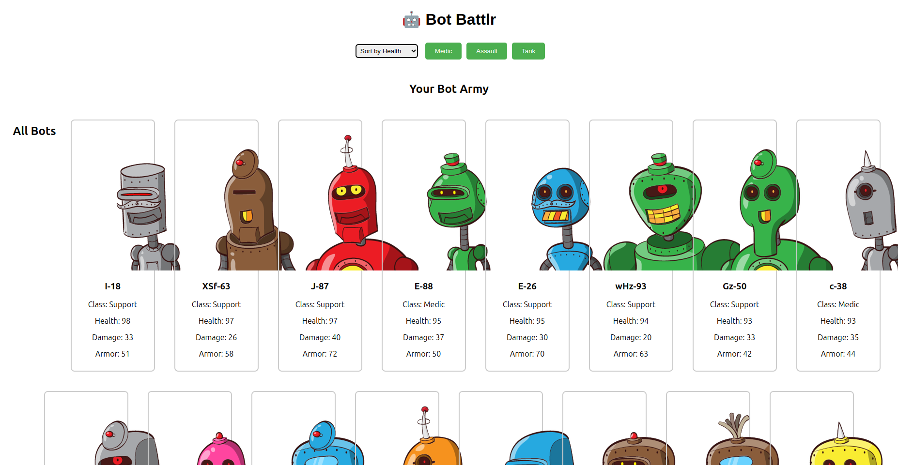

# Bot Battlr

**Bot Battlr** is an interactive React-based game that allows users to engage in fun bot battles. Users can select their favorite bots and see them clash on the battlefield.



## Project Description

This web application is designed to demonstrate core React concepts such as component composition, state management, props, and event handling — all in a fun and visual way.

## Technologies Used

- React.js
- JavaScript (ES6+)
- HTML5 & CSS3
- Git & GitHub
- JSON Server (for backend simulation)

## Getting Started

To run this project on your local machine, follow the steps below:

### 1. Clone the repository

```bash
git clone https://github.com/DevBrianHQ/bot-battlr.git
cd bot-battlr
```

### 2. Install dependencies

```bash
npm install
```

### 3. Start the JSON Server (in a separate terminal)

```bash
npx json-server --watch db.json --port 8001
```

### 4. Start the React app

```bash
npm start
```

The app will open automatically at http://localhost:3000/.

## Usage

- Browse available bots
- Add bots to your army
- View battles and manage your team
- Delete bots from your army when needed

## Live Demo

Visit the Live Site

## Contributing

Contributions are welcome! Here's how you can help:

1. Fork the repository
2. Create a new branch (`git checkout -b feature-name`)
3. Commit your changes (`git commit -m 'Add some feature'`)
4. Push to the branch (`git push origin feature-name`)
5. Open a pull request


